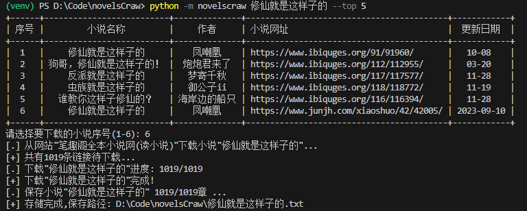
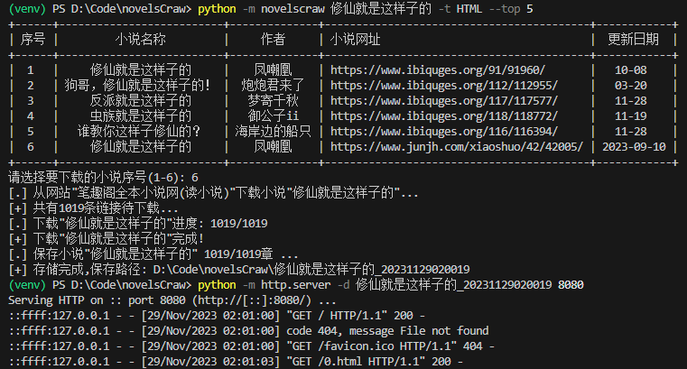
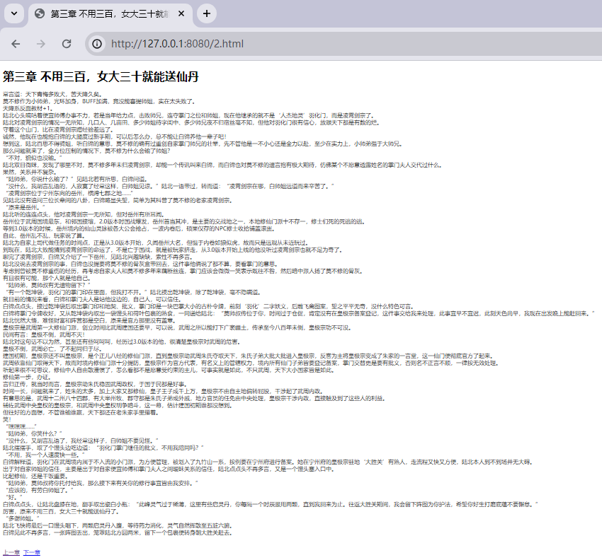

# novelsCraw
novelsCraw是一个小说爬取工具，可以将搜索到的小说下载到本地阅读，适用于不想被网站广告打扰和在线阅读无网络情况

本工具使用Python编写完成，要求Python版本>=3.11，支持Windows、Linux、MacOS等平台

## 使用方法
1. 安装python依赖包,推荐使用venv环境
```
$ python3 -m pip install -r requirements.txt 
```

2. 查看参数帮助
```
$ python -m novelscraw -h
usage: __main__.py [-h] [-d download_dir] [-t store_type] [-n craw_worker_nums] [--timeout timeout] [--top toplinks] novel_name

novelScraw: 小说爬取工具

positional arguments:
  novel_name            小说名称

options:
  -h, --help            show this help message and exit
  -d download_dir, --directory download_dir
                        小说下载后存储位置,默认为当前目录
  -t store_type, --type store_type
                        小说下载后存储类型: ['TXT', 'HTML', 'DB'], 默认为TXT格式:
  -n craw_worker_nums, --nums craw_worker_nums
                        并行爬取数量,默认为20个协程
  --timeout timeout     下载文章时的超时时间,单个链接超过该时间认为下载失败,默认超时60s
  --top toplinks        每个网站只显示前top个链接,默认为0,显示全部的链接
```

3. 使用示例

默认下载到本地txt文件：  



加上'-t'参数指定存储类型为HTML,，将会下载到本地文件夹，下载完成后使用Python自带的http库开启8080端口的HTTP服务端：



访问`http://127.0.0.1:8080/2.html`（由于没做目录页，访问根路径会列出所有文件）：



## 支持的小说网站
`*感谢以下网站提供的免费小说资源*`

| 时间 | 网站名称 | 网站地址 | 当前是否有效 |
|:----:|:-------:|:---------|:-----------:|
| 2023-11-09 | 香书小说 | https://www.ibiquges.org/ | 无效 |
| 2023-11-29 | 笔趣阁全本小说网 | https://www.junjh.com/| 无效 |


## 功能
- [x] 搜索小说
- [x] 将小说下载为TXT
- [X] 将小说下载为支持本地打开的html
- [ ] 将小说下载到SQLite3数据库中
- [ ] 在网页中看小说时能够实时换源
